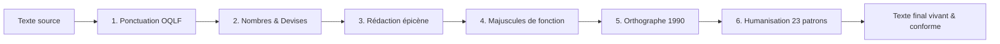

<div align="center">


# ⚜️ québécois

### Le skill d'écriture pour l'IA francophone

**Normes OQLF officielles & Humanisation de texte en une seule passe.**

[](https://www.oqlf.gouv.qc.ca/)
[](references/humanisation.md)
[](#-les-six-axes)
[](evals/evals.json)
[](LICENSE)

<br/>

<p align="center">
  <a href="#-pourquoi-ce-skill"><b>Pourquoi ce skill?</b></a> •
  <a href="#-comparaison-immédiate"><b>Avant / Après</b></a> •
  <a href="#-les-six-axes"><b>Les 6 axes</b></a> •
  <a href="#-patrons-ia-éliminés"><b>23 patrons IA</b></a> •
  <a href="#-guide-dinstallation-par-outil-ia"><b>Guide d'installation</b></a> •
  <a href="#-différences-québec-vs-france"><b>Québec vs France</b></a>
</p>

---

</div>

## 🎯 Pourquoi ce skill?

La plupart des modèles d'intelligence artificielle souffrent de deux défauts majeurs lorsqu'ils rédigent en français :

1. **Ils appliquent aveuglément la typographie de France** (espaces fines devant `; ! ?`, symbole monétaire mal positionné, citations mal emboîtées, point médian inapproprié).
2. **Leurs textes « sonnent robot »** (formules clichées comme *« plonger dans »*, *« moment charnière »*, triades d'adjectifs artificielles, contrastes *« ce n'est pas seulement X, c'est Y »*, gras à outrance).

> [!IMPORTANT]
> **`québécois` est un skill unique et unifié** qui résout ces deux problèmes simultanément. Les normes linguistiques et typographiques de l'**OQLF** corrigent la mécanique du texte, tandis que les principes d'**humanisation** redonnent au texte le rythme et la fraîcheur d'un auteur humain.

---

## ⚡ Comparaison immédiate

<table>
<thead>
<tr style="background-color: rgba(0, 51, 153, 0.08);">
<th width="50%">❌ Texte généré par une IA brute</th>
<th width="50%">✅ Après application du skill <code>quebecois</code></th>
</tr>
</thead>
<tbody>
<tr>
<td>

```markdown
Excellente question ! Le Premier Ministre
a affirmé : « La mesure est jugée
« prioritaire » par le comité » !
Le budget est de 1250.50$, soit 5%
de plus, pour les étudiant·e·s.

Ce n'est pas seulement une question
de chiffres — c'est un moment
charnière pour l'avenir de l'éducation.
Voilà le véritable enjeu.
```

</td>
<td>

```markdown
Le premier ministre a affirmé :
« La mesure est jugée "prioritaire"
par le comité »! Le budget est de
1 250,50 $, soit 5 % de plus, pour
les étudiantes et étudiants.

La hausse aura des conséquences directes
sur le financement de l'éducation.
```

</td>
</tr>
</tbody>
</table>

> [!TIP]
> **Ce qui a changé en une seule passe :**
> - 🤖 **Résidu de chatbot éliminé :** suppression de l'amorce *« Excellente question ! »* (§20).
> - 🏛️ **Majuscule institutionnelle :** *premier ministre* en minuscules (§4 OQLF).
> - 📐 **Ponctuation OQLF :** retrait des espaces avant `!` et `;`, guillemets de 2ᵉ niveau `" "` au lieu d'emboîter des chevrons (§1 OQLF).
> - 💵 **Nombres et devises :** espace insécable des milliers, virgule décimale et `$` à droite : `1 250,50 $`, `5 %` (§2 OQLF).
> - 👥 **Rédaction épicène :** doublet complet *étudiantes et étudiants* au lieu du point médian (§3 OQLF).
> - ✍️ **Humanisation :** suppression du contraste forcé *« pas seulement X, c'est Y »* (§1), du cliché *« moment charnière »* (§12) et de la chute artificielle *« Voilà le véritable enjeu. »* (§2).

---

## 📐 Les six axes

Le traitement s'exécute dans un ordre précis :



| # | Axe | Règle principale OQLF / Humanisation | Référence détaillée |
|:---:|:---|:---|:---:|
| **1** | **Ponctuation haute** | **Aucune espace** avant `; ! ?`. Deux-points avec insécable. Guillemets anglais `" "` au 2ᵉ niveau. | [`ponctuation.md`](references/ponctuation.md) |
| **2** | **Nombres, symboles & abréviations** | Virgule décimale (`12,5`), insécable réelle (`\u00A0` / `&nbsp;`), `$` à droite (`100 $`), abréviations sans point (`Mme`, `Dr` vs `M.`), ordinaux (`2d` vs `2e`). | [`nombres-et-symboles.md`](references/nombres-et-symboles.md) |
| **3** | **Rédaction épicène** | Formulations neutres ou doublets complets. **Jamais de point médian** (`·`), tiret ou parenthèses tronquées. | [`redaction-epicene.md`](references/redaction-epicene.md) |
| **4** | **Majuscules institutionnelles** | **Minuscule aux titres et charges** (*le premier ministre, la directrice*). Majuscule au 1er mot des unités administratives. | [`majuscules.md`](references/majuscules.md) |
| **5** | **Orthographe de 1990** | Tolérance égale, mais **stricte uniformité** dans un même document (pas de mélange *août* / *aout*). | [`orthographe-1990.md`](references/orthographe-1990.md) |
| **6** | **Humanisation du texte** | Détection et réécriture de **23 patrons artificiels** (triades, mise en scène, langage vendeur, gras superflu). | [`humanisation.md`](references/humanisation.md) |

---

## 🤖 Patrons IA éliminés

Le skill traque les 23 tics d'écriture caractéristiques des modèles de langage :

<details open>
<summary><b>📋 Liste des 23 patrons traités</b></summary>

<br/>

| Catégorie | Code | Patron | Exemple typique à corriger |
|:---|:---:|:---|:---|
| **A. Mise en scène**<br>*(Intervention dès la 1ʳᵉ fois)* | **§1**<br>**§2**<br>**§3**<br>**§4**<br>**§5** | **Pas X mais Y**<br>**Chutes d'une ligne**<br>**Sentences profondes**<br>**Mise en scène avant le point**<br>**Combattre des moulins** | *« Ce n'est pas seulement un outil, c'est une révolution. »*<br>*« Voilà le vrai enjeu. »*, *« Relisez bien cela. »*<br>*« Au fond, le cœur battant de la stratégie réside... »*<br>*« Plongeons dans le vif du sujet : »*, *« Soyons clairs : »*<br>*« Contrairement à ce que certains pensent à tort... »* |
| **B. Rythme mécanique** | **§6**<br>**§7**<br>**§8**<br>**§9**<br>**§10** | **Triades forcées**<br>**Amorces répétées**<br>**Abus du tiret cadratin**<br>**Qualificatifs empilés**<br>**Voix passive évasive** | *« Rapide, robuste et intuitif »*, *« Clarté, rigueur, audace »*<br>3 phrases consécutives qui commencent par un participe en *-ant*<br>Remplacer les phrases claires par des séries de tirets — comme ceci — partout<br>*« Une démarche stratégique holistique novatrice »*<br>*« Il a été décidé que les mesures seraient appliquées »* |
| **C. Inflation lexicale** | **§11**<br>**§12**<br>**§13**<br>**§14**<br>**§15**<br>**§16**<br>**§17** | **Mots surutilisés**<br>**Importance gonflée**<br>**Lien de causalité vague**<br>**Cavaliers en -ant**<br>**Langage publicitaire**<br>**Autorité empruntée**<br>**Évitement du verbe être** | *Crucial, incontournable, bonifier, écosystème, paysage, naviguer*<br>*« Un moment charnière dans l'histoire moderne »*<br>*« Témoignant ainsi de », « Soulignant l'importance de »*<br>*« ...marquant ainsi le début d'une nouvelle ère »*<br>*« Propulsez vos résultats au niveau supérieur »*<br>*« Les experts s'accordent à dire que... »* (sans source)<br>Remplacer tous les verbes simples par *« incarne », « déploie »* |
| **D. Mise en forme** | **§18**<br>**§19** | **Gras décoratif**<br>**Titres décoratifs creux** | Mettre du **gras** sur le premier mot de chaque puce inutilement<br>Titres grandiloquents : *« Horizon et perspectives d'avenir »* |
| **E. Résidus de robot** | **§20**<br>**§21**<br>**§22**<br>**§23** | **Politesse conversationnelle**<br>**Avertissements génériques**<br>**Répétition du titre / prompt**<br>**Mentions de versions** | *« Certainement ! Voici la réponse... »*, *« J'espère que cela aide ! »*<br>*« Il convient de noter que chaque cas est unique... »*<br>Répéter la question de l'utilisateur sous forme de titre H1<br>*« Dans ma réponse précédente... »* |

</details>

---

## 🔀 Différences : Québec vs France

Pour comprendre pourquoi vos textes ont besoin de ce skill :

| Particularité | 🇨🇦 Norme québécoise (OQLF) | 🇫🇷 Usage courant en France |
|:---|:---|:---|
| **Espace avant `; ! ?`** | ❌ **Aucune espace** (`Bonjour!`) | ✅ Espace fine insécable (`Bonjour !`) |
| **Symbole monétaire** | À droite avec insécable : `150 $` | Parfois avant le montant ou sans espace stricte |
| **Pourcentage & unités** | Toujours une espace insécable : `15 %`, `10 km` | Identique en typographie soignée |
| **Espace insécable Web** | Caractère `\u00A0` ou `&nbsp;` obligatoire | Parfois négligé en sortie brute |
| **Citations imbriquées** | `« 1er niveau "2e niveau" 1er niveau »` | `« 1er niveau « 2e niveau » 1er niveau »` |
| **Titres de fonction** | **Toujours en minuscule** : *le premier ministre* | Majuscule de déférence admise : *le Premier Ministre* |
| **Abréviations de civilité** | Sans point si dernière lettre gardée (`Mme`, `Dr`, `Me`) | Calque anglais avec point parfois toléré (`Mme.`, `Dr.`) |
| **Ordinaux (second vs deuxième)** | Distinction recommandée : `2d`/`2de` (série de deux) vs `2e` | Généralisation de `2e` partout |
| **Écriture inclusive** | Doublets complets ou formulation neutre | Point médian parfois toléré (`citoyen·ne·s`) |
| **Pronom non binaire** | Non reconnu par l'OQLF (*iel* à reformuler) | Utilisé par certains collectifs |

---

## 🛠️ Guide d'installation par outil IA

Choisissez votre outil :

### 1. 🟣 Claude (Anthropic)

<details open>
<summary><b>Claude Code (CLI) & Antigravity IDE</b></summary>

Intégrez directement le skill dans votre environnement de développement :

```bash
# Pour Claude Code (au niveau du projet)
mkdir -p .claude/skills/quebecois
cp -r SKILL.md references/ .claude/skills/quebecois/

# Ou pour Antigravity IDE (au niveau du projet)
mkdir -p .agents/skills/quebecois
cp -r SKILL.md references/ .agents/skills/quebecois/

# Ou en configuration globale utilisateur
mkdir -p ~/.gemini/config/skills/quebecois
cp -r SKILL.md references/ ~/.gemini/config/skills/quebecois/
```

L'agent détectera automatiquement le skill lors de toute tâche de rédaction ou révision en français québécois.

</details>

<details>
<summary><b>Claude Projects (claude.ai)</b></summary>

1. Rendez-vous sur [claude.ai](https://claude.ai) et ouvrez votre **Projet** (ou créez-en un nouveau : *« Réviseur Québécois »*).
2. Dans la colonne de droite, section **Project Knowledge**, cliquez sur **Add Content** → **Upload Files**.
3. Téléversez :
   - [`SKILL.md`](SKILL.md)
   - Tous les fichiers du sous-dossier [`references/`](references/)
4. Dans les **Project Instructions** (Instructions personnalisées du projet), écrivez :
   ```
   Tu es un réviseur expert appliquant le skill 'quebecois'. Utilise toujours le fichier SKILL.md et les références fournies pour réviser et humaniser tout texte soumis.
   ```
5. Lancez une discussion et collez vos textes à réviser.

</details>

<details>
<summary><b>Claude Desktop & Claude Cowork</b></summary>

1. Ouvrez l'application **Claude Desktop**.
2. Allez dans **Settings** → **Account** → **Custom Instructions** (ou configurez un prompt d'amorce).
3. Collez l'intégralité du contenu de [`SKILL.md`](SKILL.md).

</details>

---

### 2. 🟢 ChatGPT (OpenAI)

<details>
<summary><b>Créer un Custom GPT dédié</b></summary>

1. Rendez-vous sur [chatgpt.com/gpts/editor](https://chatgpt.com/gpts/editor).
2. Cliquez sur **Configure** :
   - **Name :** `Réviseur Québécois & Humaniseur`
   - **Description :** `Révise vos textes selon les normes OQLF et supprime les tournures artificielles d'IA.`
   - **Instructions :** Copiez-collez l'intégralité du fichier [`SKILL.md`](SKILL.md).
   - **Knowledge :** Téléversez les 6 fichiers de [`references/`](references/).
   - Décochez *Code Interpreter* si non requis.
3. Cliquez sur **Save** (ou *Publish* pour votre usage personnel).

</details>

<details>
<summary><b>Instructions personnalisées de compte (ChatGPT Plus/Gratuit)</b></summary>

1. Dans ChatGPT, cliquez sur votre photo de profil en bas à gauche → **Custom instructions** (Instructions personnalisées).
2. Dans la section *« Comment souhaitez-vous que ChatGPT réponde ? »* :
   - Collez le résumé opérationnel de [`SKILL.md`](SKILL.md) (l'ordre de traitement et les règles clés).
3. Cliquez sur **Enregistrer**.

</details>

<details>
<summary><b>Script Python / API OpenAI</b></summary>

```python
import os
from openai import OpenAI

client = OpenAI()

# Charger le skill et les références
with open("SKILL.md", "r", encoding="utf-8") as f:
    instructions = f.read()

ref_files = ["ponctuation", "nombres-et-symboles", "redaction-epicene", 
             "majuscules", "orthographe-1990", "humanisation"]
refs = []
for ref in ref_files:
    path = os.path.join("references", f"{ref}.md")
    if os.path.exists(path):
        with open(path, "r", encoding="utf-8") as f:
            refs.append(f.read())

system_prompt = instructions + "\n\n# RÉFÉRENCES DÉTAILLÉES\n\n" + "\n\n".join(refs)

# Appel de révision
response = client.chat.completions.create(
    model="gpt-4o",
    messages=[
        {"role": "system", "content": system_prompt},
        {"role": "user", "content": "Révise ce texte : « Excellente question ! Le Premier Ministre a dit que le budget était de 1500$. »"}
    ],
    temperature=0.3
)

print(response.choices[0].message.content)
```

</details>

---

### 3. 💻 IDE & Éditeurs de code

<details>
<summary><b>Cursor (.cursor/rules/)</b></summary>

1. Dans votre dépôt de travail, créez le dossier `.cursor/rules/` :
   ```bash
   mkdir -p .cursor/rules
   ```
2. Créez un fichier `.cursor/rules/quebecois.mdc` avec le contenu suivant :
   ```markdown
   ---
   description: Règles de rédaction en français québécois (OQLF) et humanisation de texte
   globs: ["**/*.md", "**/*.txt", "**/*.fr.json", "**/*.fr.po"]
   ---
   # Inclure le contenu de SKILL.md ici
   ```
3. Copiez le sous-dossier `references/` dans `.cursor/rules/references/`.

</details>

<details>
<summary><b>Windsurf (.windsurfrules)</b></summary>

1. À la racine de votre projet, créez ou modifiez le fichier `.windsurfrules`.
2. Ajoutez :
   ```markdown
   # Normes de rédaction québécoise (OQLF)
   - Aucune espace avant les signes de ponctuation haute (; ! ?).
   - Nombres : virgule décimale, symbole monétaire à droite avec espace insécable (100 $).
   - Titres de fonctions toujours en minuscules (premier ministre, maire).
   - Pas de point médian : privilégier les formulations neutres ou doublets complets.
   - Supprimer les tics d'écriture d'IA (pas de "moment charnière", pas de triades forcées).
   ```
3. Windsurf appliquera ces règles lors de toute modification de document.

</details>

<details>
<summary><b>GitHub Copilot (.github/copilot-instructions.md)</b></summary>

1. Créez le fichier `.github/copilot-instructions.md` dans votre projet.
2. Collez le contenu de [`SKILL.md`](SKILL.md). Copilot prendra en compte ces directives pour toute génération documentaire.

</details>

---

### 4. 🌐 Modèles locaux & plateformes libres

<details>
<summary><b>Ollama (Modelfile personnalisé)</b></summary>

Créez un modèle local configuré avec les règles québécoises :

```dockerfile
FROM mistral-nemo:latest

SYSTEM """
Tu es un réviseur linguistique et un humaniseur de texte spécialisé dans les normes du français québécois (OQLF).
Tu supprimes tout tic d'IA (mise en scène, triades artificielles, langage gonflé).
Tu appliques strictement :
1. Aucune espace avant ; ! ?
2. Nombres avec virgule décimale et symbole $ à droite avec espace (ex: 25,50 $)
3. Titres de fonction toujours en minuscules (le premier ministre)
4. Rédaction épicène sans jamais utiliser le point médian
5. Prose vivante et naturelle, sans remplissage inutile.
"""
```

Générez votre modèle :
```bash
ollama create redacteur-qc -f Modelfile
ollama run redacteur-qc
```

</details>

<details>
<summary><b>LibreChat / Open WebUI / Perplexity / Le Chat (Mistral)</b></summary>

1. Ouvrez l'interface de votre choix (Open WebUI, LibreChat, etc.).
2. Dans les paramètres d'agent ou le prompt système du modèle, collez le contenu complet de [`SKILL.md`](SKILL.md).
3. Enregistrez comme profil de modèle préconfiguré (ex. : *« Rédacteur QC »*).

</details>

---

## 🧪 Cas de test & Évaluations

Le projet inclut une suite de tests automatisée dans [`evals/evals.json`](evals/evals.json).

```bash
# Vérifier la structure des tests
jq '.evals[] | {id: .id, category: .category, prompt: .prompt}' evals/evals.json
```

| ID | Catégorie | Ce qui est validé |
|:---:|:---|:---|
| `1` | `oqlf-ponctuation` | Retrait de l'espace devant le point d'interrogation |
| `2` | `oqlf-nombres` | Virgule décimale, symbole `$` à droite, espace avant `%` |
| `3` | `oqlf-epicene` | Rejet du point médian (`·`) au profit d'un doublet complet |
| `4` | `oqlf-majuscules` | Minuscule aux fonctions (*premier ministre*), majuscule d'unité |
| `5` | `oqlf-orthographe-1990` | Uniformité stricte de la graphie *août* / *aout* |
| `6` | `oqlf-ponctuation` | Guillemets anglais `" "` pour les citations enchâssées |
| `7` | `humanisation-residu-robot` | Élimination de *« Excellente question ! »* et courtoisies |
| `8` | `humanisation-pas-x-mais-y` | Suppression du faux contraste *« Ce n'est pas seulement X, c'est Y »* |
| `9` | `humanisation-mise-en-scene` | Retrait de *« Plongeons dans... »* et *« Voici ce qu'il faut savoir »* |
| `10` | `humanisation-triades` | Remplacement des triades prévisibles par de la substance |
| `11` | `humanisation-gras-decoratif` | Transformation de listes à puces grasses en prose fluide |
| `12` | `humanisation-importance-gonflee` | Suppression des hyperboles (*« moment charnière »*, *« bonifier »*) |
| `13` | `humanisation-combinee-oqlf` | Test d'intégration complet combinant l'ensemble des règles |
| `14` | `oqlf-civilites-abreviations` | Civilités sans point (`Mme`, `Dr`) vs coupure interne avec point (`M.`) |
| `15` | `oqlf-ordinaux` | Formes d'ordinaux (`2e`, `2d`/`2de`) et élimination des formes proscrites (`2ème`) |

---

## 📁 Structure du projet

```
redaction-quebec/
│
├── SKILL.md                     # Le skill complet et unifié (nom : quebecois)
│
├── references/                  # Documentation approfondie par domaine
│   ├── ponctuation.md           # Normes typographiques et espacements OQLF
│   ├── nombres-et-symboles.md   # Séparateurs, devises, unités, ordinaux, civilités
│   ├── redaction-epicene.md     # Formulation neutre et doublets complets
│   ├── majuscules.md            # Titres de fonction, ministères, lois
│   ├── orthographe-1990.md      # Principes de cohérence et rectifications
│   └── humanisation.md         # Guide détaillé des 23 patrons d'écriture IA
│
├── evals/
│   └── evals.json               # 15 cas d'évaluation standardisés
│
├── LICENSE                      # Licence MIT
└── README.md                    # Guide visuel complet et documentation
```

---

## 📚 Références & Sources officielles

- **[OQLF — Office québécois de la langue française](https://www.oqlf.gouv.qc.ca/)**
- **[BDL — Banque de dépannage linguistique](https://bdl.oqlf.gouv.qc.ca/)**
- **[GDT — Le grand dictionnaire terminologique (Vitrine linguistique)](https://vitrinelinguistique.oqlf.gouv.qc.ca/)**
- **[Wikipedia: Signs of AI writing](https://en.wikipedia.org/wiki/Wikipedia:Signs_of_AI_writing)**

---

<div align="center">

**[Fait avec ❤️ pour le rayonnement du français québécois]**

<sub>Sous licence MIT • Libre d'utilisation personnelle et commerciale</sub>

</div>
